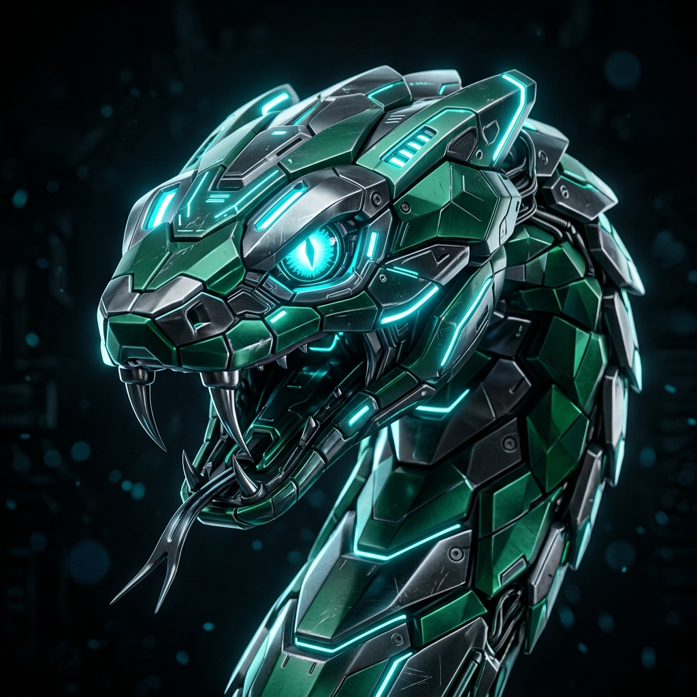
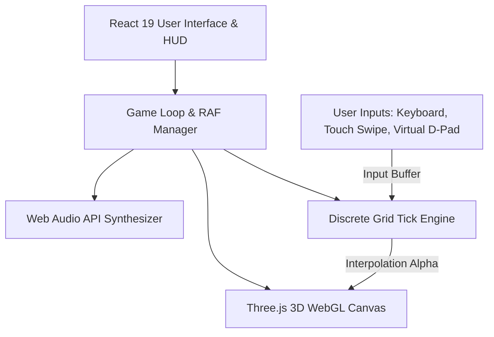

# 🐍 CYBER VIPER 3D (ثعبان السايبر ثلاثي الأبعاد)

<div align="center">



**Next-Generation 3D Snake Game built with React 19, Three.js, and Web Audio API**  
*لعبة الثعبان الكلاسيكية بحلتها المستقبلية ثلاثية الأبعاد، مع مراحل تحدي، مؤثرات ضوئية وصوتية، وتحكم سلس متوافق تماماً مع الجوال والحاسوب.*

[](https://vitejs.dev/)
[](https://react.dev/)
[](https://threejs.org/)
[](https://www.netlify.com/)
[](#license)

[**🎮 العب الآن / Live Demo**](https://naif-saleh.github.io/snake-Game-JavaScript/) • [**🌟 المميزات / Features**](#-key-features--المميزات) • [**⚙️ التقنيات والأساليب / Techniques**](#-techniques--technologies-used--التقنيات-والأساليب-المستخدمة) • [**🚀 التشغيل والنشر / Getting Started**](#-getting-started--التشغيل-المحلي)

</div>

---

## 📖 Overview / نظرة عامة

**Cyber Viper 3D** transforms the nostalgic 2D arcade Snake into an immersive, cyberpunk 3D WebGL experience. Built from scratch using modern web engineering standards, the game features smooth 60/120 FPS sub-grid motion interpolation, dynamic multi-angle cameras, 6 progressive mission stages, synthesizer-powered sound effects, and a responsive glassmorphic cyber HUD.

تم تحويل لعبة الثعبان التقليدية بالكامل إلى تجربة سايبربانك ثلاثية الأبعاد فائقة السلاسة. تم بناء اللعبة باستخدام **React 19** ومحرك **Three.js** مع مؤثرات صوتية إجرائية بدون أي ملفات خارجية، ونظام مراحل وتحديات تدريجية.

---

## ✨ Key Features / المميزات

### 1. 🌌 3D WebGL Graphics Engine (محرك رسوميات ثلاثي الأبعاد)
* **Futuristic Cyber Arena:** Glowing reflective neon floor grid, laser perimeter forcefields, and illuminated corner laser pylons.
* **Dynamic Lighting:** Real-time head-following point light, ambient stadium glows, and reactive emissive materials.
* **Visual Effects:** 3D particle explosions upon eating items and dramatic multi-stage disintegration upon collision.

### 2. 🎯 Mission Stages & Challenges (طور المراحل والتحديات)
* **Stage 1: Cyber Bootcamp (التدريب السيبراني)** – Open arena to master steering and core mechanics.
* **Stage 2: Laser Grid Outpost (حقول الليزر المضيئة)** – Laser pylons guarding the 4 corners.
* **Stage 3: Turbo Overdrive (سباق السرعة الخارق)** – 60-second speed race against the clock!
* **Stage 4: Virus Quarantine (المنطقة الفيروسية)** – Bio-hazard quarantine zone with radioactive viral spores.
* **Stage 5: Dual Labyrinth (المتاهة المزدوجة)** – Tight corridor navigation inspired by the Palestine flag theme.
* **Stage 6: The Cyber Core (قلب النظام السيبراني)** – Final boss arena with defense satellites and golden core overload.
* **3-Star Rating System & Confetti:** Automated performance scoring with victory celebrations.

### 3. ♾️ Classic Endless Mode (الطور اللانهائي المفتوح)
* 4 selectable difficulty levels: **Casual (280ms)**, **Normal (210ms)**, **Turbo (155ms)**, and **Insane (110ms)**.
* Dynamic speed acceleration as the snake grows.

### 4. 🎨 Viper Skins & 3D Food Models (المظاهر والأطعمة ثلاثية الأبعاد)
* **Viper Skins:**
  * 💎 *Cyber Neon:* Cyan and electric blue luminescence.
  * 🌋 *Magma Flame:* Glowing molten lava and crimson embers.
  * ⚡ *Emerald Matrix:* Cyberpunk green matrix energy.
  * 👑 *Gold Rush:* Polished metallic gold sheen.
  * 🇵🇸 *Palestine Freedom:* Pan-Arab red, green, black, and white design.
* **Food Themes:** Classic 3D Neon Apples, Golden Energy Cores, Glowing Viral Spores, and Palestine Emblems.

### 5. 🎥 4 Dynamic Camera Modes (أوضاع كاميرا متعددة)
* **Isometric:** Classic tactical diagonal perspective.
* **3D Chase Cam:** Smoothly tracks directly behind the snake's head with banking on turns.
* **Perspective:** Dramatic high-angle arena overview.
* **Classic 2D / Top-Down:** Direct birds-eye view for competitive precision.

### 6. 🔊 Procedural Web Audio Engine (محرك صوتي تركيبي)
* Zero-latency sound generation using the native browser **Web Audio API** (no audio asset loading needed).
* Dynamic combo audio scaling: pitch rises with each consecutive food item collected.
* Sound effects for turns, golden bonuses, countdown warnings, game overs, and victory fanfares.

### 7. 📱 Mobile & Touch Optimized (دعم كامل للجوال وشاشات اللمس)
* **Tactile Virtual D-Pad:** Floating cyber directional pad with visual and haptic feedback (`navigator.vibrate`).
* **Full-Screen Swipe Gestures:** Intuitive swipe-to-turn controls with scroll prevention.
* **Automatic Aspect Ratio Zoom:** Smart camera compensation prevents arena side-clipping on narrow mobile screens.

### 8. 🛡️ Safe Spawn & Start-on-Input System (حماية البداية والتحكم)
* **Start-on-Input:** The game never starts without player consent. A clean ready badge appears, allowing the player to observe the map and begin by pressing any key or swiping.
* **Southern Safety Runway:** Snakes spawn with at least 12 clear tiles ahead in every single stage.
* **Spawn Shield:** 2-move initial collision protection preventing accidental immediate death.

---

## ⚙️ Techniques & Technologies Used / التقنيات والأساليب المستخدمة



### 1. High-Framerate Sub-Grid Interpolation (Decoupled Game Loop)
* **Concept:** Traditional snake games update snake positions in discrete grid steps (e.g., every 200ms), which looks choppy in 3D.
* **Technique:** The game decouples discrete game ticks from the rendering loop. While game logic evaluates at discrete intervals, the Three.js render loop runs at 60/120+ FPS via `requestAnimationFrame`.
* **Lerp Math:** Each segment's position is smoothly interpolated between `prevSnakeBody` and `currentSnakeBody` using `THREE.Vector3.lerpVectors` with fractional time alpha:
  $$\alpha = \min\left(1, \frac{\text{currentTime} - \text{lastTickTime}}{\text{tickInterval}}\right)$$
* **Portal / Wrap Compensation (`getAdjustedCoord`):** When passing through wrap-around borders in non-solid mode, coordinate wrapping is handled so segments do not visually stretch across the entire grid.

### 2. Procedural Sinusoidal Slithering & Head Banking
* **Snake Physics:** The head dynamically banks and rolls into turns by computing the cross product between the current forward vector and the new heading vector.
* **Slither Wave:** A subtle sine wave modulation ($y = \sin(\text{time} \cdot 8 + i \cdot 0.5) \cdot 0.08$) is applied across the segments, giving the snake an organic, fluid slithering motion.

### 3. Zero-Asset Procedural Sound Synthesis (Web Audio API)
* Rather than loading external `.mp3` or `.wav` files (which cause HTTP latency and bandwidth overhead), the sound system generates all waveforms programmatically using `AudioContext`:
  * **Oscillator Nodes:** Sine, Triangle, Sawtooth, and Square wave generators.
  * **Envelope Modeling:** Exponential gain decays (`exponentialRampToValueAtTime`) replicate retro-arcade chiptune dynamics.
  * **Dynamic Pitch Modulation:** Combos modulate base frequencies upwards ($F = F_0 \times 1.08^{\text{combo}}$), rewarding player momentum.

### 4. Direct Input Buffering & Reversal Prevention
* To prevent accidental opposite-direction self-collision when rapid keys are pressed, input is buffered through `dirRef` and `nextDirRef`.
* Validates that new input is perpendicular ($newDir.x \neq current.x \land newDir.y \neq current.y$) before accepting turns.

### 5. Dual Particle Explosion Engines
* **Eat Burst:** 28 radial spheres explode outward with random trajectory angles and fade over 0.6 seconds.
* **Death Disintegration:** 60 glowing fragments scatter with physics velocity and bounce dampening on the floor grid ($v_y = -0.5 \cdot v_y$).

### 6. Mobile Viewport Compensation Math
* On narrow mobile viewports ($w / h < 1$), camera distance is scaled proportionally:
  $$\text{Scale} = 1 + \left(\frac{1}{\text{aspectRatio}} - 1\right) \times 0.6$$
  This ensures that the entire $20 \times 20$ field and outer walls remain 100% visible on any phone screen.

---

## 🎮 Controls / طريقة التحكم

| Device / الجهاز | Action / الإجراء | Control / الزر |
| :--- | :--- | :--- |
| **Desktop (الحاسوب)** | Move Up / للأعلى | <kbd>↑</kbd> or <kbd>W</kbd> |
| **Desktop (الحاسوب)** | Move Down / للأسفل | <kbd>↓</kbd> or <kbd>S</kbd> |
| **Desktop (الحاسوب)** | Move Left / لليسار | <kbd>←</kbd> or <kbd>A</kbd> |
| **Desktop (الحاسوب)** | Move Right / لليمين | <kbd>→</kbd> or <kbd>D</kbd> |
| **Desktop (الحاسوب)** | Pause / إيقاف مؤقت | <kbd>Space</kbd> |
| **Desktop (الحاسوب)** | Change Camera / تبديل الكاميرا | <kbd>C</kbd> |
| **Desktop (الحاسوب)** | Restart / إعادة المحاولة | <kbd>R</kbd> |
| **Desktop (الحاسوب)** | Toggle Audio / كتم الصوت | <kbd>M</kbd> |
| **Mobile (الجوال)** | Move / التوجيه | **أزرار الـ D-Pad** أو **السحب (Swipe Gesture)** |
| **Mobile (الجوال)** | Start / البدء | انقر على زر **انطلق (START)** أو اسحب في أي اتجاه |

---

## 🛠️ Tech Stack / الحزمة التقنية

* **Core Framework:** [React 19](https://react.dev/) + [Vite 8](https://vitejs.dev/)
* **3D Engine:** [Three.js (r186)](https://threejs.org/)
* **Icons:** [Lucide React](https://lucide.dev/)
* **Celebration FX:** [Canvas Confetti](https://www.npmjs.com/package/canvas-confetti)
* **Styling:** Modern Vanilla CSS (Glassmorphism, Cyberpunk CSS Variables, Flexbox/Grid)
* **Audio:** Web Audio API (Synthesizer)
* **Deployment:** [Netlify](https://www.netlify.com/) (automated SPA redirects & configuration)

---

## 🚀 Getting Started / التشغيل المحلي

### Prerequisites
* [Node.js](https://nodejs.org/) (version 18 or higher recommended)
* npm or yarn

### Installation & Run

1. **Clone the repository:**
   ```bash
   git clone https://github.com/naif-saleh/snake-Game-JavaScript.git
   cd snake-Game-JavaScript
   ```

2. **Install dependencies:**
   ```bash
   npm install
   ```

3. **Start local development server:**
   ```bash
   npm run dev
   ```
   Open [http://localhost:5173](http://localhost:5173) in your browser.

4. **Build for production:**
   ```bash
   npm run build
   ```
   The production-ready bundle will be generated inside the `dist/` directory.

---

## 🌐 Netlify Deployment / النشر على نتليفاي

The project includes pre-configured [`netlify.toml`](netlify.toml) and [`public/_redirects`](public/_redirects).

1. Connect your repository to **Netlify**.
2. Netlify will automatically detect:
   * **Build command:** `npm run build`
   * **Publish directory:** `dist`
3. Hit **Deploy Site**!

---

## 📁 Project Structure / هيكل المشروع

```
snake-Game-JavaScript/
├── public/
│   ├── assets/              # Avatar images, textures & icons
│   ├── _redirects           # Netlify SPA redirect rules
│   └── favicon.svg          # Neon snake favicon
├── src/
│   ├── components/
│   │   ├── ControlsOverlay.jsx    # Touch D-Pad & keyboard guidance
│   │   ├── GameHUD.jsx            # Top glassmorphic HUD & stage tracker
│   │   ├── GameOverModal.jsx      # Game over score card & stats
│   │   ├── SettingsModal.jsx      # Customization & difficulty settings
│   │   ├── SnakeCanvas.jsx        # Core Three.js 3D WebGL renderer
│   │   ├── StageClearModal.jsx    # Stage victory modal with 3-star score
│   │   ├── StageSelectModal.jsx   # Mission selector & challenge browser
│   │   └── StartScreenModal.jsx   # Cyber title splash screen
│   ├── data/
│   │   └── stages.js              # 6 Challenge stage configs & obstacles
│   ├── utils/
│   │   └── audio.js               # Web Audio API procedural synthesizer
│   ├── App.jsx                    # Game loop & application state manager
│   ├── index.css                  # Cyberpunk design system & animations
│   └── main.jsx                   # React root entrypoint
├── netlify.toml                   # Automated Netlify deployment config
├── vite.config.js                 # Vite bundler configuration
└── package.json                   # Dependencies & build scripts
```

---

## 📄 License / الترخيص

This project is open source and available under the [MIT License](LICENSE).

---

<div align="center">
  <sub>Developed with 💻 & ☕ by Naif Saleh</sub>
</div>
